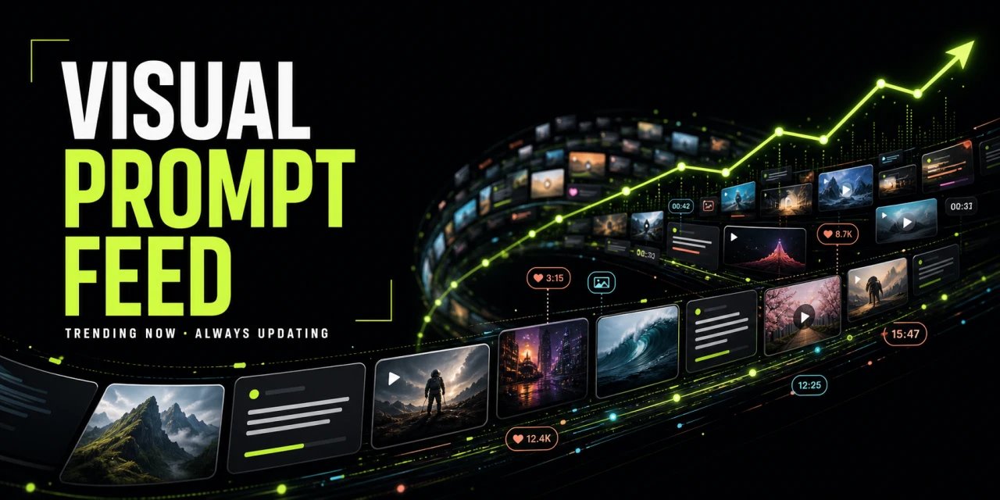

# Visual Prompt Feed

[](https://github.com/Hanyuyu/visual-prompt-feed/actions/workflows/sync.yml)
[](https://creativecommons.org/licenses/by/4.0/)
[](DATA-LICENSE.md)



A continuously refreshed public feed of AI image and video prompts from
public X posts, with original authors, source links, preview media, and
machine-readable datasets.

New records are discovered by [ByRadar](https://byradar.org), then verified,
categorized, and structured by [ImgLume](https://imglume.com) before
publication.

Every record preserves the original X author and post URL. This repository
does **not** claim that publicly posted prompt text or source media is licensed
under CC BY 4.0. ImgLume's original curation and dataset structure are CC BY
4.0; original prompt text and source media are marked `NOASSERTION`.

<!-- DATASET-STATS:START -->
**2403 prompts** from **2295 source posts** and **324 authors**, with **4332 source-media links**.

Last feed refresh: `2026-09-12T17:17:18.632Z`

| Category | Image | Video | Total |
| --- | ---: | ---: | ---: |
| Animation | [3](catalog/image/animation.md) | [149](catalog/video/animation.md) | 152 |
| Architecture | [13](catalog/image/architecture.md) | [10](catalog/video/architecture.md) | 23 |
| Camera Moves | 0 | [154](catalog/video/camera-moves.md) | 154 |
| Character | [139](catalog/image/character.md) | [128](catalog/video/character.md) | 267 |
| Cinematic | [70](catalog/image/cinematic.md) | [767](catalog/video/cinematic.md) | 837 |
| Food Drink | [15](catalog/image/food-drink.md) | [86](catalog/video/food-drink.md) | 101 |
| Illustration 3d | [86](catalog/image/illustration-3d.md) | 0 | 86 |
| Nature | [22](catalog/image/nature.md) | [23](catalog/video/nature.md) | 45 |
| Photography | [727](catalog/image/photography.md) | [2](catalog/video/photography.md) | 729 |
| Poster Design | [154](catalog/image/poster-design.md) | 0 | 154 |
| Product Ads | [26](catalog/image/product-ads.md) | [106](catalog/video/product-ads.md) | 132 |
| Product Brand | [4](catalog/image/product-brand.md) | [1](catalog/video/product-brand.md) | 5 |
| Travel | [63](catalog/image/travel.md) | [76](catalog/video/travel.md) | 139 |
| UGC | [1](catalog/image/ugc.md) | [150](catalog/video/ugc.md) | 151 |
| Ui Graphic | [3](catalog/image/ui-graphic.md) | [1](catalog/video/ui-graphic.md) | 4 |
<!-- DATASET-STATS:END -->

## Browse the collection

- [Image prompt catalog](catalog/image/)
- [Video prompt catalog](catalog/video/)
- [Categories](indexes/categories/)
- [Recommended models](indexes/models/)
- [Latest changes](changes/latest.json)

The Markdown catalog is built for browsing. The files under `data/` are the
canonical machine-readable snapshot.

## Use the data

| Format | File | Best for |
| --- | --- | --- |
| JSON | [`data/prompts.json`](data/prompts.json) | Complete records and licensing metadata |
| JSONL | [`data/prompts.jsonl`](data/prompts.jsonl) | Streaming, search, and model pipelines |
| CSV | [`data/prompts.csv`](data/prompts.csv) | Spreadsheets and lightweight analysis |
| JSON Schema | [`schema/prompt.schema.json`](schema/prompt.schema.json) | Record validation |

JavaScript example:

```js
const response = await fetch(
  'https://raw.githubusercontent.com/Hanyuyu/visual-prompt-feed/main/data/prompts.json',
);
const { items } = await response.json();

const cinematicPrompts = items.filter((item) =>
  item.categories.includes('cinematic'),
);
```

## Optional MCP integration

To search the live visual catalog from Codex, Claude Code, Cursor, or another
MCP host, use the open-source
[ImgLume MCP](https://github.com/Hanyuyu/imglume-mcp). It can retrieve full
source-linked prompts, improve visual briefs, and generate or edit images and
videos. The downloadable feed remains independently usable; the MCP is
optional.

## What gets published

A record is included only when it:

1. was discovered through ByRadar;
2. preserves a public X post URL and author handle;
3. passed ImgLume ingestion and moderation;
4. remains visible in the ImgLume prompt gallery.

The snapshot is rebuilt from the public
[`imglume.open-prompts.v1`](https://imglume.com/api/open-prompts/v1/prompts)
endpoint every day. Removed or no-longer-public records disappear from the next
snapshot. Generated files are deterministic, so the workflow commits only real
data changes.

## Rights and attribution

This repository uses a layered rights model:

- **Original prompt text and source media:** `NOASSERTION`; rights remain with
  the original source authors.
- **ImgLume curation:** CC BY 4.0 for ImgLume's original categorization,
  tagging, model compatibility, verification, selection, organization, and
  dataset structure, to the extent those contributions are protectable.
- **Synchronization code:** MIT.

If you reuse ImgLume's curation, attribute:
`ImgLume — https://imglume.com — CC BY 4.0`.

Keep each record's `source.author`, `source.url`, `source.license`, and
`source.rightsHolder` fields with the prompt. Read
[DATA-LICENSE.md](DATA-LICENSE.md) before reuse.

## Corrections and removals

Original authors can request an attribution correction or removal. See
[TAKEDOWN.md](TAKEDOWN.md). Dataset files are generated; please do not edit
them by hand. Use [CONTRIBUTING.md](CONTRIBUTING.md) for corrections and
taxonomy improvements.
